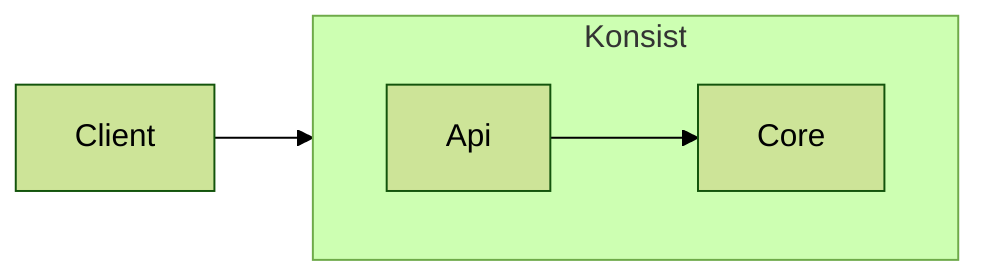

# Developer Readme

## Status

| Repository                                                                        | Build Status                                                                                                    |
|-----------------------------------------------------------------------------------|-----------------------------------------------------------------------------------------------------------------|
| [Konsist](https://github.com/LemonAppDev/konsist)                                 |                  |
| [Konsist Documentation](https://github.com/LemonAppDev/konsist-documentation)     | -                                                                                                               |

## Publish To Maven Repository

- Publish Local: `./gradlew publishToMavenLocal -Pkonsist.releaseTarget=local` publish to local `~/.m2/repository`
- Publish Snapshot `./gradlew publish -Pkonsist.releaseTarget=snapshot` publish to
  [snapshot repository](https://s01.oss.sonatype.org/content/repositories/snapshots/com/lemonappdev/konsist/)
- Publish Release `./gradlew publish -Pkonsist.releaseTarget=release` publish to
  [release repository](https://s01.oss.sonatype.org/content/repositories/releases/com/lemonappdev/konsist/). This
  artefact will be transferred to [maven central](https://central.sonatype.com/artifact/com.lemonappdev/konsist)
  repository after some time.

## Release

1. Create `release-vx.y.z` branch
2. Update version in `gradle.properties` file and starter projects (`sample/starter-projects`) and create PR to `main`.
3. Merge release branch to `main`
4. Run `./gradlew publish -Pkonsist.releaseTarget=release` to publish to release repository
5. Create a [new GitHub release](https://github.com/LemonAppDev/konsist/releases/new)
    1. set `vx.y.z` as tag version
    2. set `vx.y.z` as release title
6. Update Konsist version in the Konsist [Quick Starte](https://app.gitbook.com/o/PQj191UX5M2C2XxCZuYO/s/RYeSMx6WDKivnwWx7PdP/getting-started/gettingstarted) page 
7. Run `/scripts/update-snippets.py` snippet to generate PR with updated snippets for Konsist Documentation
8. Merge above PR
9. Notify community
10.   Message on [Konsist Channel](https://kotlinlang.slack.com/archives/C05QG9FD6KS) in Kotlin Slack
11.   Tweet
12.   Linkedin

## Sonatype

- [Nexus Repository Manager](https://s01.oss.sonatype.org/#nexus-search;quick~konsist)
- [Sonatype Jira](https://issues.sonatype.org/secure/Dashboard.jspa)

## Repositories Links

- [mvnrepository.com](https://mvnrepository.com/artifact/com.lemonappdev/konsist/)
- [central.sonatype.com](https://central.sonatype.com/artifact/com.lemonappdev/konsist/)

## Generate KDocs

- `./gradlew dokkaHtml` - generate KDocs in `./lib/build/dokka/html/index.html`

## Layers

Below is a diagram of the layers of the `konsist` library:

## Custom Source Sets

- `apiTest` - tests multiple classes together
- `integrationTest` - test each class in separation 
- `konsistTest` - tests using `konsist` library using `konsist` library code
- `snippets` - contain code snippets, written as tests, but lacking `@Test` annotation, so they will no te executed
- `test` - unit tests with mocks (tests using `mockk` library)

# Naming Conventions

If we create extensions with `vararg` for a property in a declaration class we must check its return type.

## Singular return type

We have two options: this type always exist (like name or path) or is optional (like package or parent class).
In both cases create two extensions:

- with prefix 'with' and the name of the property in the singular number
    - Such extension filters all objects in which this property complies with one of the given conditions
- with prefix 'without' and the name of the property in the singular number
    - Such extension filters all objects in which this property not complies with any of the given conditions

### Type always exist
E.g. In `KoClassDeclaration`, the `name` property returns `String` (singular - it's one object),
so we create two extensions:
- `withName(name: String, vararg names: String)`
- `withoutName(name: String, vararg names: String)`

### Type is optional
E.g. In `KoClassDeclaration`, the `parentClass` property returns `KoParentDeclaration` (singular - it's one object), 
so we create two extensions:
    - `withParentClass(vararg names: String)`
    - `withoutParentClass(vararg names: String)`

The difference is that in the first case we force passing the parameter, in the second it is optional.

## Return type is a list of objects

Create six extensions:
- with prefix 'with' and the name of the property in the plural number
  - Such extension filters all objects in which this property complies with any condition
- with prefix 'withAll' and the name of the property in the plural number
  - Such extension filters all objects in which this property complies with all the given conditions
- with prefix 'withSome' and the name of the property in the plural number
  - Such extension filters all objects in which this property complies with at least one of the given conditions
- with prefix 'without' and the name of the property in the plural number
    - Such extension filters all objects in which this property not complies with any condition
- with prefix 'withoutAll' and the name of the property in the plural number
  - Such extension filters all objects in which this property not complies with all the given conditions
- with prefix 'withoutSome' and the name of the property in the plural number
    - Such extension filters all objects in which this property not complies with at least one of the given conditions

E.g. In `KoClassDeclaration`, the `parentInterfaces` property returns `List<KoParentDeclaration>` (plural - it's list 
of objects), so we create three extensions:
- `withParentInterfaces()`
- `withAllParentInterfaces(name: String, vararg names: String)`
- `withSomeParentInterfaces(name: String, vararg names: String)`
- `withoutParentInterfaces()`
- `withoutAllParentInterfaces(name: String, vararg names: String)`
- `withoutSomeParentInterfaces(name: String, vararg names: String)`

Note that there are no parameters with the `with` and `without` prefixes, and in other cases we force the parameter 
to be passed.

## If parameters of extensions is of KClass type, then extension must have suffix 'Of'.

E.g. In `KoClassDeclaration`:
- `withParentClassOf(vararg names: KClass<*>)`
- `withoutParentClassOf(vararg names: KClass<*>)`

- `withAllParentInterfacesOf(name: KClass<*>, vararg names: KClass<*>)`
- `withSomeParentInterfacesOf(name: KClass<*>, vararg names: KClass<*>)`
- `withoutAllParentInterfacesOf(name: KClass<*>, vararg names: KClass<*>)`
- `withoutSomeParentInterfacesOf(name: KClass<*>, vararg names: KClass<*>)`
