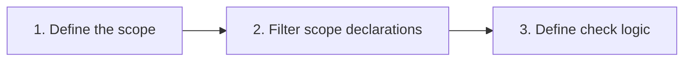

# Konsist

[](https://kotlinlang.org)


Konsist helps to guard [Kotlin](https://kotlinlang.org/) project consistency. It allows to standardise Kotlin codebase
and enforce coding conventions tailored for given project.

Example checks:
- Check if all repository classes are reside in repository package
- Check if every use case has one public function
- Check if class is not using forbidden dependencies
- Check if `Controller` class is annotated with `@Controller` Annotation 
- Check if use case has one public function
- Check if no classes are using Java util logging 
- and much more… see sample checks

Konsist is compatible with popular testing frameworks such as [JUni4](https://junit.org/junit4/) and 
[JUnit5](https://junit.org/junit5/).

# How This Works?

Konsist is build on top of Kotlin compiler and provides user-friendly API to query Kotlin files. Syntax reflects Kotlin
code itself and mimics Kotlin [collection processing](https://kotlinlang.org/docs/collections-overview.html) API.

The
[KoScope](src/main/kotlin/com/lemon/konsist/core/declaration/KoScope.kt) class is the entry point. It represents set
of Kotlin files to be verified. It can be created for a single Kotlin file, given folder, package or from the whole 
project.

At high level every konsist test looks like this:



Here is an example of a simple test:

```kotlin
class ControllerClassKonsistTest {
    private val sut = KoScope.fromProject() // 1. Create scope representing the whole project (all project Kotlin files)

    @Test
    fun `classes annotated with 'RestController' annotation should reside in __application__controller__ package`() {
        projectScope
            .classes() // 2. Get all classes in the project
            .filter { it.isAnnotatedWith("RestController") } // 2. Filter classes annotated with 'RestController'
            .check { it.resideInPackages("..application..controller..") } // 3. Define check logic
    }
}
```

The [check](src/main/kotlin/com/lemon/konsist/core/assertion/check/Check.kt) method is a terminal method that performs
verification of the code base.

# Setup

Add Konsist dependency.

```
dependency:konsist
```

## Advanced test

The `with...` extensions are available for all declarations exposed by Konsist library. If you need a more advanced 
config you can utilise Kotlin collection processing API including 
[map](https://kotlinlang.org/api/latest/jvm/stdlib/kotlin.collections/map.html) and 
[filter](https://kotlinlang.org/api/latest/jvm/stdlib/kotlin.collections/filter.html) functions:

```kotlin
class UseCaseKonsistTest {
    private val useCaseScope = projectScope
        .classes()
        .filter { it.name.endsWith("UseCase") }

    @Test
    fun `UseCase class should reside in __domain__usecase__ package`() {
        sut.check { it.resideInPackages("..domain..usecase..") }
    }
}
```

API provides a way to exclude certain declarations from the scope such as data classes or classes in given package.

## Why there are no pre-defined rules?

Many linters including [Detekt](https://github.com/detekt/detekt) and [ktlint](https://github.com/pinterest/ktlint)
have predefined set of rules. These rules are derived and aligned with guidelines or common practices for writing good 
code and industry coding conventions ([Kotlin coding conventions](https://kotlinlang.org/docs/coding-conventions.html), 
[Android Kotlin style guide](https://developer.android.com/kotlin/style-guide), etc.). 

However, there are no industry standards when comes to application architecture. Every code base is different - 
different class naming, different package structure, different application layers... These "rules" are also hard to 
capture in a linter, because they are very specific to the project. Consider a simple use case class:
- can use case extend or include another use case?
- should every use case to have `UseCase` suffix?
- what package these use cases should resist in?
- what annotations use case should have?
- should use case have a single method?
- how this method should be named?
- can this method have overloads?
- should this method always be `suspended`?
- …

Every of the above questions can be answered differently in different projects. Capturing all of these details would 
result in large number of rules and rigid API. That's why konsist favours more flexible approach - it allows you to 
define your own tests (checks) using Kotlin collection processing API.

That's being set I am considering adding a small set of predefined rules. Some things can be standardised across 
different projects e.g. constructor parameter names being derived from the property name, or alphabetic the order of 
the parameters.
