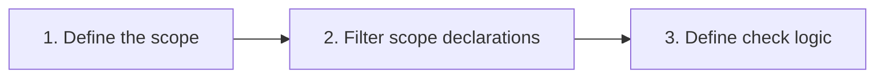

# Konsist

[](https://kotlinlang.org)

Konsist helps to guard [Kotlin](https://kotlinlang.org/) project consistency. It allows to standardise Kotlin codebase
and enforce coding conventions tailored for given project.

Features:
- Code base consistency verification
- Define custom rules
- Guard architecture layers
- Suppress issues in source files using `@Suppress` annotations
- Compatible with popular testing frameworks such as [JUni4](https://junit.org/junit4/) and
  [JUnit5](https://junit.org/junit5/)
- ...

See [documentation](http://docs.konsist.lemonappdev.com/) for more details and code samples.

Example checks:
- Check if all repository classes are reside in repository package
- Check if every use case has one public function
- Check if class is not using forbidden dependencies
- Check if `Controller` class is annotated with `@Controller` Annotation 
- Check if use case has one public function
- Check if no classes are using Java util logging 
- and much more… see sample checks

# How This Works?

Konsist is build on top of Kotlin compiler and provides user-friendly API to query Kotlin files. Syntax reflects Kotlin
code itself and mimics Kotlin [collection processing](https://kotlinlang.org/docs/collections-overview.html) API.

The
[KoScope](src/main/kotlin/com/lemon/konsist/core/declaration/KoScope.kt) class is the entry point. It represents set
of Kotlin files to be verified. It can be created for a single Kotlin file, given folder, package or from the whole 
project.

At high level every konsist test looks like this:



Here is an example of a simple test:

```kotlin
class ControllerClassKonsistTest {
    private val sut = KoScope.fromProject() // 1. Create scope representing the whole project (all project Kotlin files)

    @Test
    fun `classes annotated with 'RestController' annotation should reside in __application__controller__ package`() {
        projectScope
            .classes() // 2. Get all classes in the project
            .filter { it.isAnnotatedWith("RestController") } // 2. Filter classes annotated with 'RestController'
            .check { it.resideInPackages("..application..controller..") } // 3. Define check logic
    }
}
```

The [check](src/main/kotlin/com/lemon/konsist/core/assertion/check/Check.kt) method is a terminal method that performs
verification of the code base.

# Setup

Add Konsist dependency.

```
dependency:konsist
```

## Advanced test

The `with...` extensions are available for all declarations exposed by Konsist library. If you need a more advanced 
config you can utilise Kotlin collection processing API including 
[map](https://kotlinlang.org/api/latest/jvm/stdlib/kotlin.collections/map.html) and 
[filter](https://kotlinlang.org/api/latest/jvm/stdlib/kotlin.collections/filter.html) functions:

```kotlin
class UseCaseKonsistTest {
    private val useCaseScope = projectScope
        .classes()
        .filter { it.name.endsWith("UseCase") }

    @Test
    fun `UseCase class should reside in __domain__usecase__ package`() {
        sut.check { it.resideInPackages("..domain..usecase..") }
    }
}
```

API provides a way to exclude certain declarations from the scope such as data classes or classes in given package.

## Licence

Konsist is distributed under the terms of the Apache License (Version 2.0). See [LICENSE.md](LICENSE.md) for details.

## Contributing

Please be sure to review Konsist's [contributing guidelines](https://docs.konsist.lemonappdev.com/help/contribute)
to learn how to help the project.
