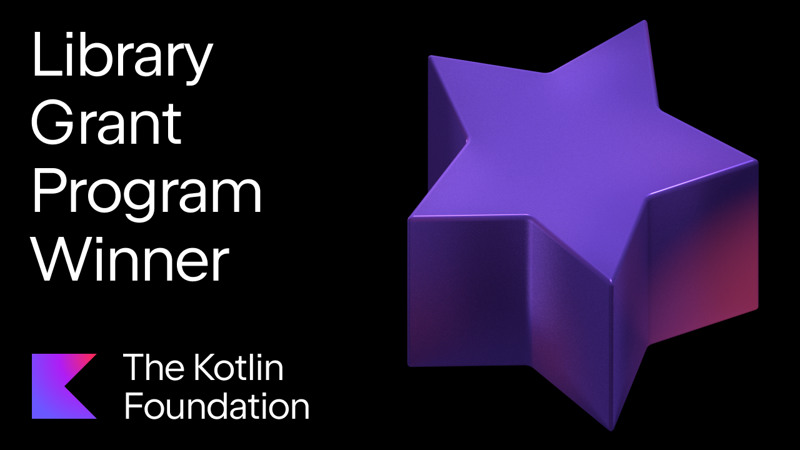

==========

[](https://kotlinlang.org)

[](https://central.sonatype.com/artifact/com.lemonappdev/konsist)

Konsist is a linter that guards the consistency of [Kotlin](https://kotlinlang.org/) projects by enforcing a cohesive code structure 
and unified architecture. Konsist guards are written in the form of unit tests ([JUnit](https://junit.org/) / [Kotest](https://kotest.io/)).

<p align="center">
  <a href="https://kotlinfoundation.org/news/grants-program-winners-24/" target="_blank" rel="noopener noreferrer">
    
  </a>
</p>

## Dependencies

```kotlin
// Gradle Kotlin:
testImplementation("com.lemonappdev:konsist:0.16.1")

// Gradle Groovy:
testImplementation "com.lemonappdev:konsist:0.16.1"

// Maven:
<dependency>
    <groupId>com.lemonappdev</groupId>
    <artifactId>konsist</artifactId>
    <version>0.16.1</version>
    <scope>test</scope>
</dependency>
```

## Getting Started

To begin using Konsist in your project, consider these steps:

1. See [Konsist Documentation](https://docs.konsist.lemonappdev.com/) to familiarize yourself with Konsist's 
   features and usage guidelines.
2. Check [Starter Projects](https://github.com/LemonAppDev/konsist/tree/main/samples/starter-projects) to see Konsist in action.
3. Review [Konsist API Reference](https://reference.konsist.lemonappdev.com) to learn about the available API methods.

## Examples

Konsist API reflects the structure of Kotlin code. All declarations such as classes, functions, and properties can be
queried and verified with the Konsist API. Take a look at a few examples below.

### General Kotlin Check

```kotlin
@Test
fun `classes with 'UseCase' suffix should reside in 'usecase' package`() {
    Konsist.scopeFromProject()
        .classes()
        .withNameEndingWith("UseCase")
        .assertTrue { it.resideInPackage("..usecase..") }
}
```

### Android Specific Check

```kotlin
@Test
fun `classes extending 'ViewModel' should have 'ViewModel' suffix`() {
    Konsist.scopeFromProject()
        .classes()
        .withAllParentsOf(ViewModel::class)
        .assertTrue { it.name.endsWith("ViewModel") }
}
```

### Spring Specific Check

```kotlin
@Test
fun `interfaces with 'Repository' annotation should have 'Repository' suffix`() {
    Konsist
        .scopeFromProject()
        .interfaces()
        .withAllAnnotationsOf(Repository::class)
        .assertTrue { it.hasNameEndingWith("Repository") }
}
```

### Architecture Layers Check

```kotlin
@Test
fun `clean architecture layers have correct dependencies`() {
    Konsist
        .scopeFromProduction()
        .assertArchitecture {
            // Define layers
            val domain = Layer("Domain", "com.myapp.domain..")
            val presentation = Layer("Presentation", "com.myapp.presentation..")
            val data = Layer("Data", "com.myapp.data..")

            // Define architecture assertions
            domain.dependsOnNothing()
            presentation.dependsOn(domain)
            data.dependsOn(domain)
        }
}
```
    
Check out our [snippet](https://docs.konsist.lemonappdev.com/inspiration/snippets) page for a feast of examples!
    
## Articles & Videos

Check the [videos & articles](https://docs.konsist.lemonappdev.com/getting-started/getting-started/articles).

## Star History

[](https://star-history.com/#LemonAppDev/konsist&Date)

## Support 

We're here to help you make the most of Konsist. Here are the best ways to get support:

For quick inquiries and general discussions, join our [#konsist Slack channel](https://kotlinlang.slack.com/archives/C05QG9FD6KS).
Use [GitHub Discussion](https://github.com/LemonAppDev/konsist/discussions) for bug reports, issues, and feature requests.

## Contributing

Please be sure to review Konsist [contributing guidelines](https://docs.konsist.lemonappdev.com/help/contributing)
to learn how to support the project.

## Licence

Konsist is distributed under the terms of the Apache License (Version 2.0). See [LICENSE.md](LICENSE) for details.
