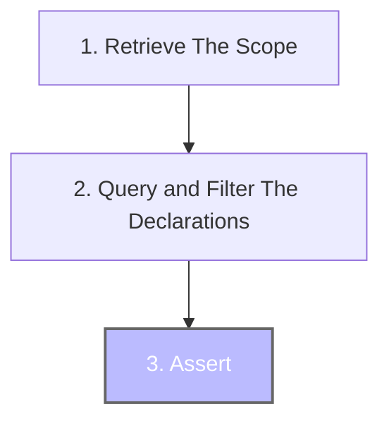

# Assert

Assertions are used to perform code base verification. It is the final step of Konsist verification preceded by scope retrieval ([koscope.md](koscope.md "mention")) and [declaration-quering-and-filtering.md](declaration-quering-and-filtering.md "mention") steps:



## Assert

In the below snippet, the assertion (performed on the list of interfaces) verifies if every interface has a `public` visibility modifier.

```kotlin
scope
    .interfaces()
    .assert { it.hasPublicModifier() }
```

The `it` parameter inside the `assert` the method represents a single declaration (single interface in this case), however, the assertion itself will be performed on every available interface.&#x20;

## Assert Not

The `assertNot` is a negation of the `assert` method. In the below snippet, the assertion (performed on the list of properties) verifies if none of the properties has the `Inject` annotation:

```kotlin
scope
    .classes()
    .flatMap { it.properties() }
    .assertNot { it.hasAnnotation<Inject>() }
```

## Exceptions Thrown

The `assert` and `assertNot`methods throw:

* `KoCheckFailedException` if the assertion criteria are not met. The error message contains a descriptive location, pointing to the exact spot in the codebase
* `KoPreconditionFailedException` if the assertion is performed on an empty list
