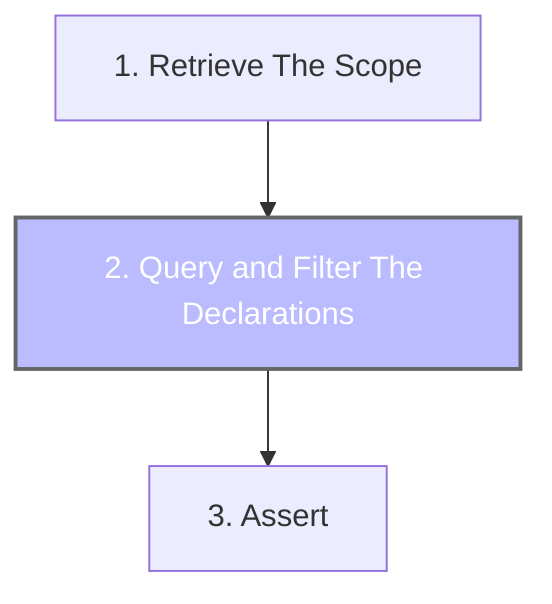

# Declaration Quering And Filtering

## Declaration Querying

Declaration querying is performed to retrieve declarations of a given type. It is the middle step of Konsist config preceded by scope retrieval ([koscope.md](koscope.md "mention")) and followed by verification ([assert.md](assert.md "mention")) step.



Every [koscope.md](koscope.md "mention") contains a set of declarations ([declaration.md](declaration.md "mention")) such as classes (`KoClass`), properties (`KoProperty`), functions (`KoFunction`), etc. The `KoScope` class provides a set of methods to access Kotlin declarations. Each method returns a list representing a declaration subset:

|                      |                                                    |
| -------------------- | -------------------------------------------------- |
| Method               | Description                                        |
| `files()`            | returns all files present in the scope             |
| `packages()`         | returns all packages present in the scope          |
| `imports()`          | returns all imports present in the scope           |
| `classes()`          | returns all classes present in the scope           |
| `interfaces()`       | returns all interfaces present in the scope        |
| `objects()`          | returns all objects present in the scope           |
| `functions()`        | returns all functions present in the scope         |
| `properties()`       | returns all properties present in the scope        |
| `companionObjects()` | returns all companion objects present in the scope |
| `typeAliases()`      | returns all type aliases present in the scope      |
| `declarations()`     | returns all declarations present in the scope      |

To get all classes from the given scope use `KoScope.classes()` method:

```kotlin
koScope
    .classes()

```

Here is an example of querying all properties defined inside classes:

```kotlin
    koScope
        .classes()
        .properties()
        .assert { // .. }
```

## Declaration Filtering

More granular filtering can be applied to additionally filter classes annotated with certain attributes like classes annotated with `RestController` annotation:

```kotlin
koScope
    .classes()
    .withAnnotation<RestController>
```

Konsist is compatible with [Kotlin Collection processing](https://kotlinlang.org/docs/collections-overview.html#list) API, so the `filter` the method can be used to additionally filter the content of the `Sequence<KoClass>`: Here filter return classes annotated with `UseCase` annotation:

```kotlin
koScope
    .classes()
    .filter { it.hasAnnotation<UseCase>() }
    .assert { // .. }
```

Konsist provides a set of `with...` extensions to simplify the syntax. The below snippet is an improved version of the above snippet:

```kotlin
koScope
    .classes()
    .withParentClass<BaseUseCase>()
    .assert { // .. }
```

Multiple conditions can be applied to perform more specific filtering. The below snippet filters classes with the `BaseUseCase` parent class that reside in the `usecase` package:&#x20;

```kotlin
koScope
    .classes()
    .withParentClass<BaseUseCase>()
    .resideInPackage("..usecase")
    .assert { // .. }
```

## Declaration Queuing And Filtering

Queuing and filtering stages can be mixed together to perform more specific checks. The below snippet filters classes reside in the `controller` package, retrieves all properties and filter properties with `Inject` annotation:

```kotlin
koScope
    .classes() // query all classes
    .resideInPackage("..controller") // filter classes in 'controller' package
    .properties()  // query all properties
    .withAnnotation<Inject>() // filter classes in 'controller' package
    .assert { // .. }
```

## Print Declarations

To help with debugging Konsist provides `printDeclarations` method that prints all declarations. This method helps to make sure that verification is performed on the correct list of declarations.

```kotlin
scope
    .classes()
    .flatMap { it.properties() }
    .printDeclarations(
```
