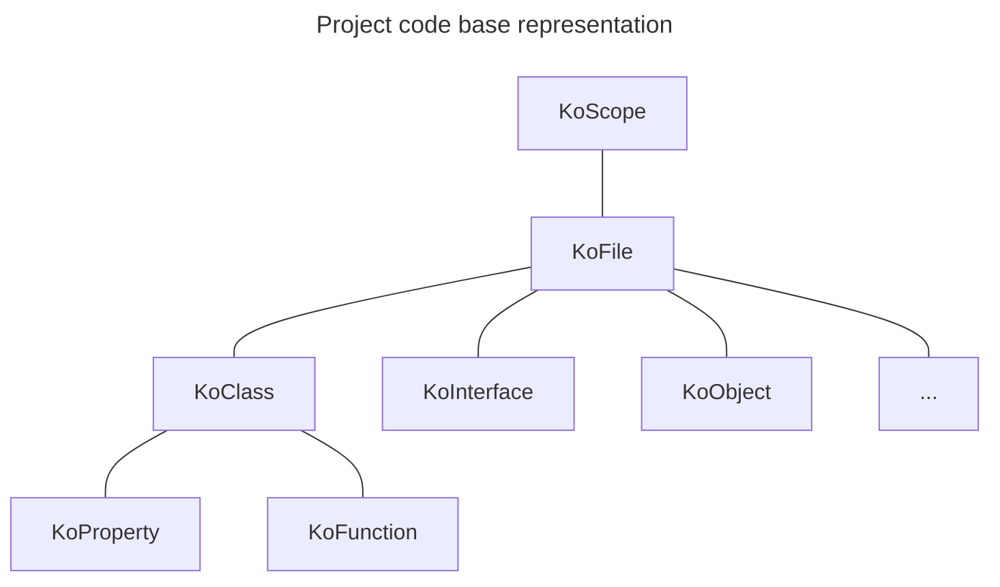

# Scope

The [KoScope](https://github.com/LemonAppDev/konsist/blob/main/src/main/kotlin/com/lemon/konsist/core/declaration/KoScope.kt) class is the entry point. It represents set of Kotlin files to be verified by Konsist library. Scope can be created for a single Kotlin file, folder, package, module or entire project.

Consider this scope:



Scope allows to query available kotlin files to tailor the code base verification. ([KoFile.kt](https://github.com/LemonAppDev/konsist/blob/main/src/main/kotlin/com/lemon/konsist/core/declaration/KoFile.kt)), classes (),

Scopes should be reused across tests to improve test performance:

```
tests/
├─ data/
│  ├─ DataTest.kt
├─ app/
│  ├─ AppTest.kt
├─ MyScope.kt   <--- Instance of the KoScope used in both DataTest and AppTest classes.

```

## Scope creation

The `KoScope` class allows to create scope containing all Kotlin files present in the project:

```kotlin
KoScope.fromProjectFiles() // All Kotlin files present in the project
KoScope.fromProjectFiles(module = "app") // All Kotlin files present in the "app" module
KoScope.fromProjectFiles(sourceSet = "test") // All Kotlin files present in the "test" source sets
```

The `module` and `sourceSet` arguments allows to create more granular scopes.

### More Granular Scopes

It is also possible to create more granular scopes to store different subsets of project files e.g.

* scope representing for production code
* scope representing for test code
* scope representing specific application layer
* ...

Here is an example of creating scopes for production code and test code:

```kotlin
KoScope.fromProjectTestFiles() // All Kotlin files present test sources sets
KoScope.fromProjectProductionFiles() // All Kotlin files present production sources sets
```

Here is an example of creating scope for all files stored in `usecase` package:

```kotlin
val myScope = KoScope.fromPackage("..usecase..")
```

> You can read more about package selector in [PackageSelector.md](packageselector.md).

Here is an example of creating scope for all files stored in `domain` folder\`:

```kotlin
val myScope = KoScope.fromPath("/domain")
```

It is also possible to create scope from a single file:

```kotlin
val myScope = KoScope.fromFile("/domain/UseCase.kt")
```

For even more granular control you can use `KoScope.slice` method to retrieve a scope containing subset of files from the scope:

```kotlin
// scope containing all files in "test" folder
koScope.slice { it.relativePath.contains("/test/") }

// scope containing all files in "com.domain.usecase" package
koScope.slice { it.hasImport("com.domain.usecase") }

// scope containing all files in "usecase" package and its subpackages
koScope.slice { it.hasImport("usecase..") }
```

The `KoScope` can be printed to display list of all files present in the scope. Here is an example:

```kotlin
println(koScope)
```

## Filtering Declarations

The `KoScope` class provides a set of methods to access Kotlin declarations. Each method returns a list representing a subset declarations of the original scope:

* `files()` - returns all files present in the scope
* `classes()` - returns all classes present in the scope
* `interfaces()` - returns all interfaces present in the scope
* `objects()` - returns all objects present in the scope
* `functions()` - returns all functions present in the scope
* `properties()` - returns all properties present in the scope
* `companionObjects()` - returns all companion objects present in the scope
* `declarations()` - returns all declarations present in the scope

Here is an example of retrieving all classes present in the scope:

```kotlin
@Test
    fun `every BaseUseCase child class has UseCase suffix`() {
        scope
            .classes()
            .filter { it.parentClass == "BaseUseCase" }
            .check { it.name.endsWith("UseCase") }
    }
```

Here is an example of retrieving all properties defined in classes and verifying that they are not annotated with `Inject` annotation:

```kotlin
@Test
    fun `no classes should use field injection`() {
        mangoScope
            .classes()
            .flatMap { it.properties() }
            .checkNot { it.hasAnnotation(Inject::class) }
    }
```

## Scope composition

It is possible to compose scopes using Kotlin operators:

```kotlin
// add scopes
val allKoScope = productionScope + testScope

// subtract scopes
val outerLayersScope = allLayersScope - domainLayerScope
```
