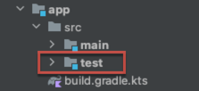

# Add Custom Test Directory

The `konsist` library can be added to the project by adding the dependency on the existing `test` source set (see [gettingstarted.md](gettingstarted.md "mention")).



As the project grows it is desirable to isolate each type of test e.g. isolate unit tests from Konsist tests.  To organize tests a new supplemental test source directory `konsistTest` can be defined.&#x20;


## Add Test Source Directory

This section demonstrates how to add the `konsistTest` test source directory inside the `app` module. This test directory will have  `kotlin` folder containing Kotlin code.



Use the Gradle built-in [JVM Test Suite plugin](https://docs.gradle.org/current/userguide/jvm\_test\_suite\_plugin.html) to define the `konsistTest` source set. Add a `testing` block to the project configuration:

```kotlin
// app/build.gradle.kts

plugins {
    java
    `jvm-test-suite`
}

testing {
    suites {
        register("konsistTest", JvmTestSuite::class) {
            dependencies {
                // Add 'main' source set dependency
                implementation(project())
                
                // Add Konsist dependency
                implementation("com.lemonappdev:konsist:0.7.4") 
            }
        }
    }
}

// Add optionally to run Konsist tests with the Gradle 'check' task
tasks.named("check") { 
    dependsOn(testing.suites.named("integrationTest"))
}
```



Use the Gradle built-in [JVM Test Suite plugin](https://docs.gradle.org/current/userguide/jvm\_test\_suite\_plugin.html) to define the `konsistTest` source set. Add a `testing` block to the project configuration:

```kotlin
// app/build.gradle

plugins {
    id 'java'
    id 'jvm-test-suite'
}

testing {
    suites { 
        test { 
            useJUnitJupiter() 
        }

        integrationTest(JvmTestSuite) { 
            dependencies {
                // Add 'main' source set dependency
                implementation project() 
                
                // Add Konsist dependency
                implementation "com.lemonappdev:konsist:0.7.4"
            }

            targets { 
                all {
                    testTask.configure {
                        shouldRunAfter(test)
                    }
                }
            }
        }
    }
}

// Add optionally to run Konsist tests with the Gradle 'check' task
tasks.named('check') { 
    dependsOn(testing.suites.integrationTest)
}
```



Use the [Maven build helper plugin](https://github.com/mojohaus/build-helper-maven-plugin) to define the `konsistTest` test source directory. Add plugin config to the project configuration:

````xml
// app/pom.xml

<plugin>
    <groupId>org.codehaus.mojo</groupId>
    <artifactId>build-helper-maven-plugin</artifactId>
    <version>3.3.0</version>
    <executions>
        <execution>
            <id>add-konsist-test-source</id>
            <phase>generate-test-sources</phase>
            <goals>
                <goal>add-test-source</goal>
            </goals>
            <configuration>
                <sources>
                    <source>src/konsistTest/kotlin</source>
                </sources>
            </configuration>
        </execution>
    </executions>
</plugin>
```
````



&#x20;Create `app/src/konsistTest/kotlin` folder and reload the project. The IDE will present a new `konsistTest` source set in the `app` module.

<figure><figcaption><p>konsistTest sorce directory</p></figcaption></figure>

The `konsistTest` test source folder works exactly like build-in `test` source folder, so Kosist tests can be defined and executed in a similar way:



```
 ./gradlew app:konsistTest
```






