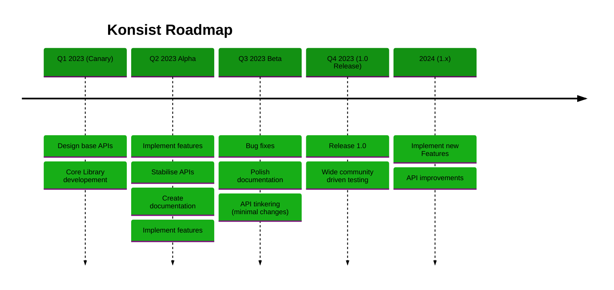

# Project Status

The project is in the early stage. It has been used in production, however, there are still some minor features missing and API is not stable yet.

Konsist roadmap:

```mermaid
%%{init: { 'theme': 'forest', 'timeline': {'disableMulticolor': true} , 'themeVariables': {
'cScale0': '#139113',
'cScale1': '#00ff00',
'cScale2': '#0000ff'
} } }%%
timeline
    title Konsist Roadmap
    Q1 2023 (Canary): Design base APIs
    : Core Library developement
    Q2 2023 Alpha: Implement features
            : Stabilise APIs
            : Create documentation
            : Implement features
    Q3 2023 Beta: Bug fixes
            : Polish documentation
            : API tinkering (minimal changes)
    Q4 2023 (1.0 Release): Release 1.0
    : Wide community driven testing
    2024 (1.x): Implement new Features
    : API improvements 
```
