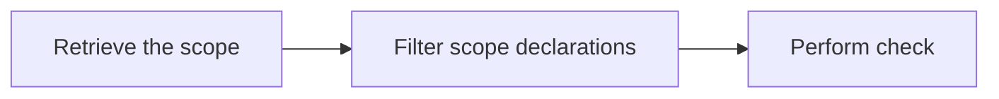

# Getting Started

### Add Repository

Add `mavenCentral` repository:

```
repositories {
    mavenCentral()
}
```

### Add Konsist Dependency



Add the following dependency to the `module\build.gradle.kts` file:

```kotlin
dependencies {
    testImplementation(KONSIST_DEPENDENCY)
}
```



Add the following dependency to the `module\build.gradle` file:

```groovy
dependencies {
    implementation "com.lemonappdev:konsist:0.7.4"
}
```



Add the following dependency to the `module\pom.xml` file:

```xml
<dependency>
    <groupId>com.lemonappdev</groupId>
    <artifactId>konsist</artifactId>
    <version>0.7.4</version>
</dependency>
```



Dependency can be added to other build systems as well. Check the [snippets](https://central.sonatype.com/artifact/com.lemonappdev/konsist) section in the sonatype repository.&#x20;



> Note: To achieve better test separation Konsist can be configured using dedicated `konsistTest` source set. See [configurekonsist.md](configurekonsist.md "mention").

#### Usage

Konsist provides API to query the project Kotlin codebase. It provides [KoScope](https://github.com/LemonAppDev/konsist/blob/main/docs/src/main/kotlin/com/lemon/konsist/core/declaration/KoScope.kt) class as an entry point for parsing project files.

At high-level Konsist API works as follows:



Konsist tests are written in form of JUnit tests. Here is an example of a test verifying that all classes annotated with `RestController` annotation resides in the correct package:

```kotlin
class ControllerClassKonsistTest {
    private val sut = KoScope.fromProject() // 1. Create a scope representing the whole project (all Kotlin files in project)

    @Test
    fun `classes annotated with 'RestController' annotation should reside in __application__controller__ package`() {
        projectScope // 1. Use the scope
            .classes() // 2. Get all classes in the project
            .filter { it.isAnnotatedWith("RestController") } // 2. Filter classes annotated with 'RestController'
            .check { it.resideInPackages("..application..controller..") } // 3. Define the check
    }
}
```

The scope can be also filtered to retrieve other types of declarations such as interfaces, objects, properties, constructors, etc. See [KoScope](https://github.com/LemonAppDev/konsist/blob/main/docs/src/main/kotlin/com/lemon/konsist/core/declaration/KoScope.kt).

For more tests see the [Broken link](broken-reference "mention") section.

### Write A Test

Konsis API mimics the code available in the Kotlin files.

Project Status

The project is in the early stage. it has been used in production, however, there are still some minor features missing and API is not stable yet.

Konsist roadmap:
