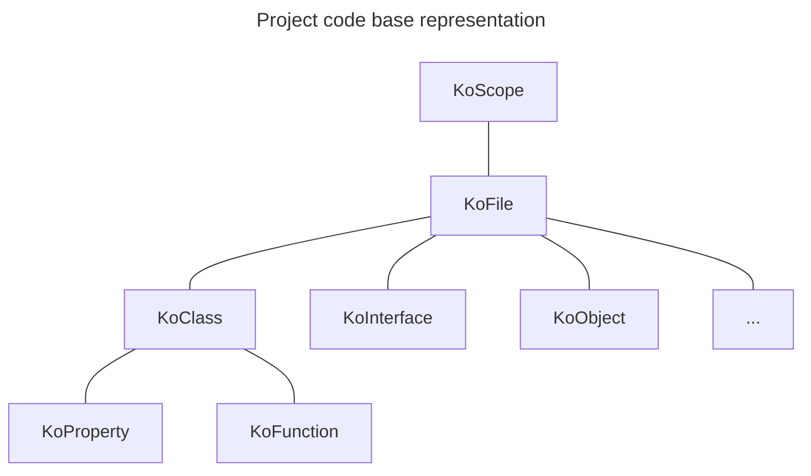

# Under The Hood

Konsist is built on top of [Kotlin Compiler Psi](https://github.com/JetBrains/kotlin/tree/master/compiler/psi/src/org/jetbrains/kotlin/psi). It wraps the Kotlin compiler parser and provides a simple API to access Kotlin code declarations.

[declaration.md](../features/declaration.md "mention") tree mimics the Kotlin code structure:

To build a declaration tree create an instance of the [KoScope.md](https://github.com/LemonAppDev/konsist/blob/main/docs/KoScope.md) class.
