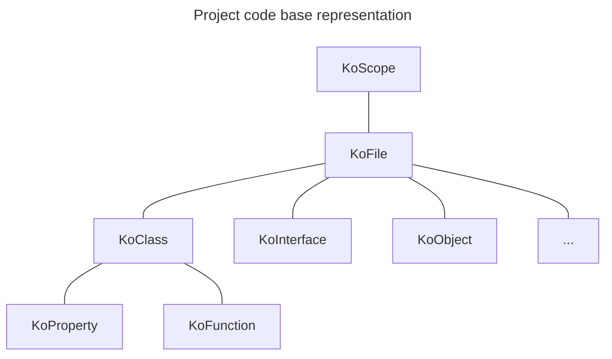
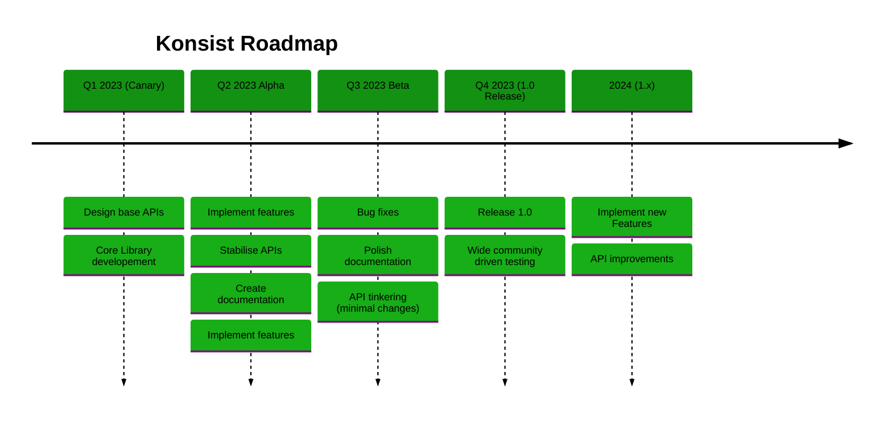

# Introduction

Konsist helps to guard [Kotlin](https://kotlinlang.org/) project consistency. It allows to standardise Kotlin codebase
and enforce coding conventions tailored for given project.

## Under The Hood

Konsist is built on top of [Kotlin Compiler Psi](https://github.com/JetBrains/kotlin/tree/master/compiler/psi/src/org/jetbrains/kotlin/psi).
It wraps Kotlin compiler parser and provides a simple API to access Kotlin code declarations. 
Declarations tree mimics the Kotlin code structure:

To build declaration tree create instance of the [KoScope.md](KoScope.md) class.

## Project Status

Project is in early stage. it has been used in production, however there are still some minor features missing and API
is not stable yet. 

Konsist roadmap:

