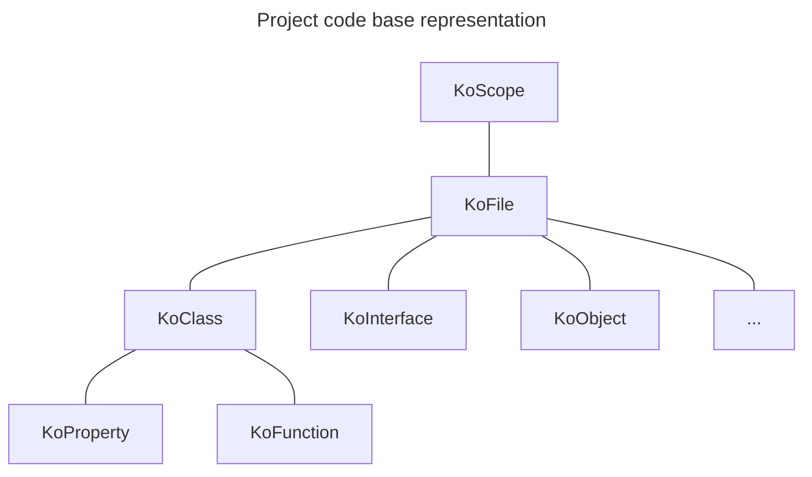

# KoScope

The
[KoScope](../src/main/kotlin/com/lemon/konsist/core/declaration/KoScope.kt) class is the entry point. It represents set
of Kotlin files to be verified by Konsist library. Scope can be created for a single Kotlin file, folder, package, module
or entire project. Here is the sample scope.

Consider this scope:



Scope allows to query available kotlin files to tailor the code base verification.
([KoFile.kt](../src/main/kotlin/com/lemon/konsist/core/declaration/KoFile.kt)), 
classes (),

Avoid creating scope for every test.

## Scope creation

The `KoScope` class allows to create scope containing all Kotlin files present in the project:

```kotlin
val myScope = KoScope.fromProject()

```

## More Granular Scopes

It is also possible to create more granular scopes to store different subsets of project files e.g.
- scope representing for production code
- scope representing for test code
- scope representing specific application layer
- ...

Here is an example of creating scope for all files stored in `usecase` package:

```kotlin
val myScope = KoScope.fromPackage("..usecase..")
```

You can read more about package selector in [PackageSelector.md](PackageSelector.md).

Here is an example of creating scope for all files stored in `domain` folder`:

```kotlin
val myScope = KoScope.fromPath("/domain")
```

It is also possible to create scope from a single file:

```kotlin
val myScope = KoScope.fromFile("/domain/UseCase.kt")
``` 

For even more granular control you can use `KoScope.slice` method to retrieve a scope containing subset of files 
from the scope:

```kotlin
// scope containing all files in "test" folder
koScope.slice { it.relativePath.contains("/test/") }

// scope containing all files in "com.domain.usecase" package
koScope.slice { it.hasImport("com.domain.usecase") }

// scope containing all files in "usecase" package and its subpackages
koScope.slice { it.hasImport("usecase..") }
```

## Filtering Declarations

Scope can be further filtered to retrieve specific declarations. For example, to retrieve all classes in the scope:

```kotlin

```

## Scope Reuse

Scopes should be reused across tests to improve test performance:

```
tests/
├─ data/
│  ├─ DataTest.kt
├─ app/
│  ├─ AppTest.kt
├─ MyScope.kt   <--- Instance of the KoScope used in both DataTest and AppTest

```

## Scope composition

It is possible to compose scopes using Kotlin operators:

```kotlin
// add scopes
val allKoScope = productionScope + testScope

// subtract scopes
val outerLayersScope = alllayersScope - domainScope
```
