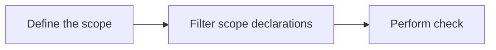
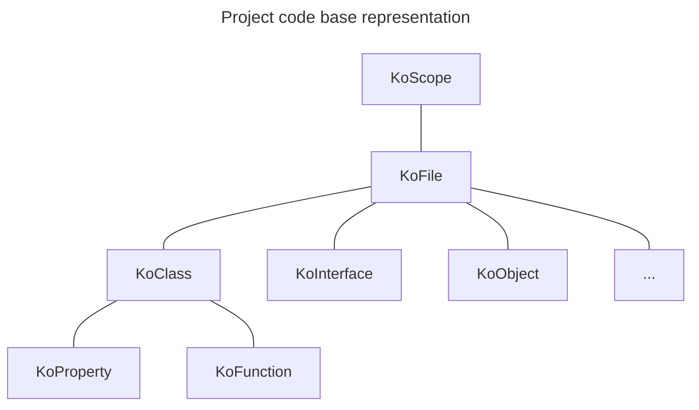
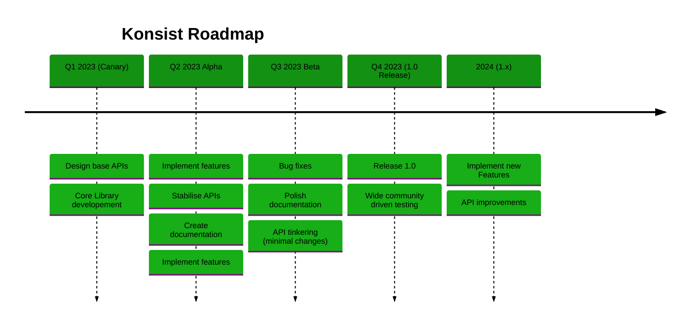

# Introduction

Konsist helps to guard [Kotlin](https://kotlinlang.org/) project consistency. It allows to standardise Kotlin codebase
and enforce coding conventions tailored for given project.

## Getting Started

Add the following dependency to the `module\build.gradle.kts` file:

```kotlin
dependencies {
    testImplementation(KONSIST_DEPENDENCY)
}
```

> Note: Konsist can be configured using custom `konsistTest` source set. See [ConfigureKonsist.md](ConfigureKonsist.md).

### Usage

Konsist provides API to query the project Kotlin codebase. It provides
[KoScope](src/main/kotlin/com/lemon/konsist/core/declaration/KoScope.kt) class as entry point for parsing project files.

At high level Konsist API works as follows:



Konsist test are written in form of JUnit tests. Here is an example of a test verifying that all classes annotated with 
`RestController` annotation reside in correct package:


```kotlin
class ControllerClassKonsistTest {
    private val sut = KoScope.fromProject() // 1. Create scope representing the whole project (all Kotlin files in project)

    @Test
    fun `classes annotated with 'RestController' annotation should reside in __application__controller__ package`() {
        projectScope // 1. Use the scope
            .classes() // 2. Get all classes in the project
            .filter { it.isAnnotatedWith("RestController") } // 2. Filter classes annotated with 'RestController'
            .check { it.resideInPackages("..application..controller..") } // 3. Define the check
    }
}
```

Scope can be also filtered to retrieve other types of declarations such as interfaces, objects, properties, constructors etc.
See [KoScope](src/main/kotlin/com/lemon/konsist/core/declaration/KoScope.kt).

## Under The Hood

Konsist is built on top of [Kotlin Compiler Psi](https://github.com/JetBrains/kotlin/tree/master/compiler/psi/src/org/jetbrains/kotlin/psi).
It wraps Kotlin compiler parser and provides a simple API to access Kotlin code declarations. 

Declarations tree mimics the Kotlin code structure:



To build declaration tree create instance of the [KoScope.md](KoScope.md) class.

## Project Status

Project is in early stage. it has been used in production, however there are still some minor features missing and API
is not stable yet. 

Konsist roadmap:


