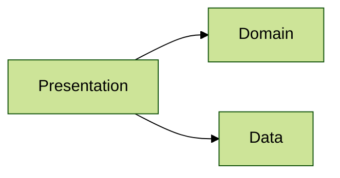

# Architecture 10

Test scenario where single `Presentation` layer file imports `Domain` layer, `Data` layer and an external class.
Failure messages should list only the imports that break the rule:

