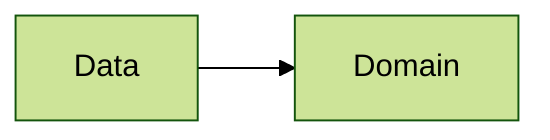

# Architecture 11

Test scenario where `Util` package and a file without a package reside outside every declared layer.
`requireAllFilesInLayers()` should report these files:

```mermaid
%%{init: {'theme': 'forest'}}%%
flowchart LR
    Data --> Domain
```
