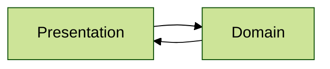

# Architecture 3

Test scenario where `Presentation` layer depends on `Domain` one and `Domain` layer depends on `Presentation` one:

```mermaid
%%{init: {'theme': 'forest'}}%%
flowchart LR
    Presentation --> Domain
    Domain --> Presentation
```
