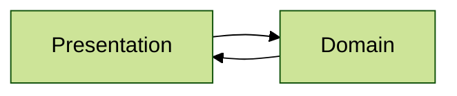

# Architecture 3

Circular dependency test scenario where:
- `Presentation` layer depends on `Domain` layer 
- `Domain` layer depends on `Presentation` layer

```mermaid
%%{init: {'theme': 'forest'}}%%
flowchart LR
    Presentation --> Domain
    Domain --> Presentation
```
