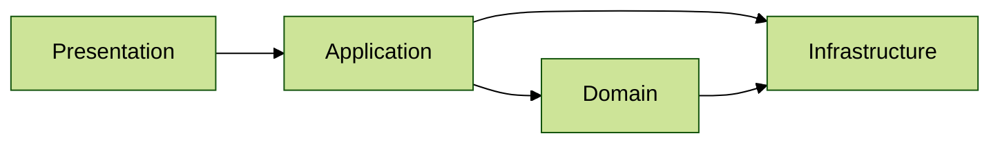

# Architecture 5

Test scenario where:
- `Presentation` layer depends on `Application` layer  
- `Application` and `Domain` layer depends on `Infrastructure`:

```mermaid
%%{init: {'theme': 'forest'}}%%
flowchart LR
    Presentation --> Application
    Application & Domain --> Infrastructure
    Application --> Domain
```
