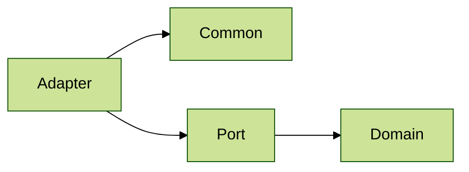

# Architecture 7

Test scenario where `Adapter` depends on `Common` and `Port`, `Port` depends on `Domain`:

```mermaid
%%{init: {'theme': 'forest'}}%%
flowchart LR
    Adapter --> Common & Port
    Port --> Domain
```
