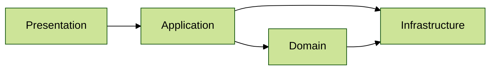

# Architecture 7

Test scenario where `Presentation` depends on `Application`, `Application` depends on `Domain` and `Infrastructure`,
`Domain` depends on `Infrastructure`:

```mermaid
%%{init: {'theme': 'forest'}}%%
flowchart LR
    Presentation --> Application
    Application & Domain --> Infrastructure
    Application --> Domain
```
