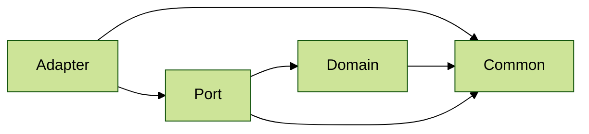

# Architecture 7

Test scenario where:
- `Adapter`layer depends on `Common` and `Port` layers
- `Port` layer depends on `Domain` and `Common` layers 
- `Domain`depends on `Common`
- `Common` depends on nothing:

