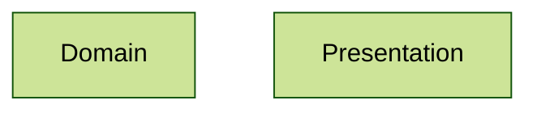

# Architecture 8

Test scenario where you test projects from different paths.

## Projects

### project_1

Test scenario with two independent layers:

### project_2

Test scenario with two independent layers:

