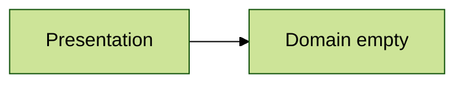

# Architecture 9

Test `strict` parameter for `dependsOn` methods.

Test scenario where `Presentation` layer depends on empty `Domain` one:

```mermaid
%%{init: {'theme': 'forest'}}%%
flowchart LR
    Presentation --> Domain[Domain empty]
```
