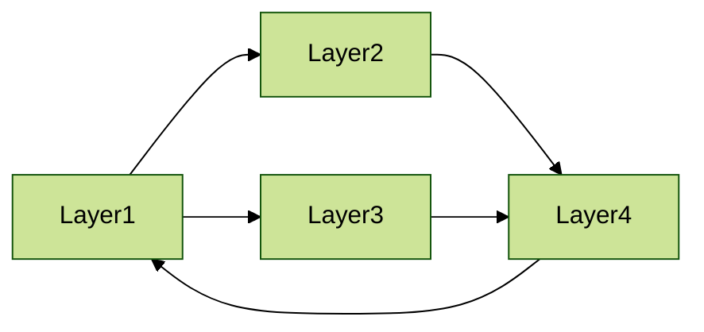

# Circular dependency 4

Test scenario with circular dependency:

```mermaid
%%{init: {'theme': 'forest'}}%%
flowchart LR
    Layer1 --> Layer2 & Layer3
    Layer2 --> Layer4
    Layer3 --> Layer4
    Layer4 --> Layer1
```
