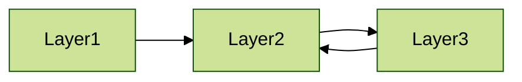

# Circular dependency 5

Test scenario with circular dependency that does not include the first layer:

```mermaid
%%{init: {'theme': 'forest'}}%%
flowchart LR
    Layer1 --> Layer2
    Layer3 --> Layer2
    Layer2 --> Layer3
```
