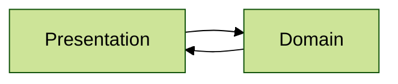

# Architecture 3

Here we're testing situation where Presentation and Domain layers are interdependent (example of circular dependency). 
See below diagram:

```mermaid
%%{init: {'theme': 'forest'}}%%
flowchart LR
    Presentation  --> Domain 
    Domain --> Presentation
```
