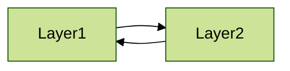
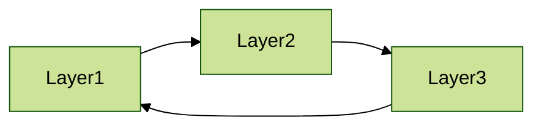
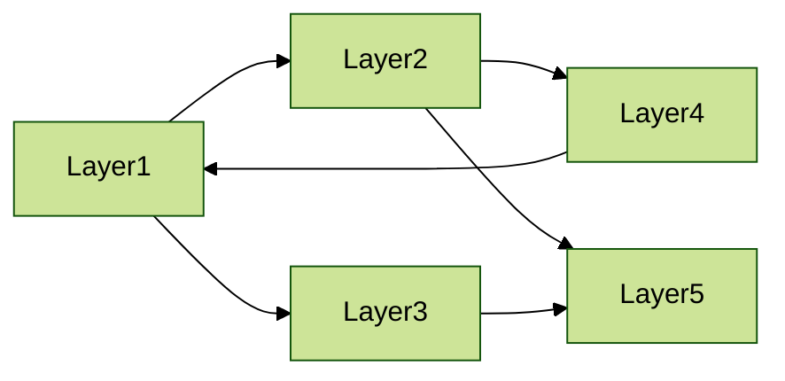
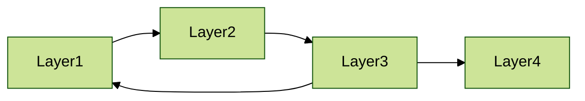
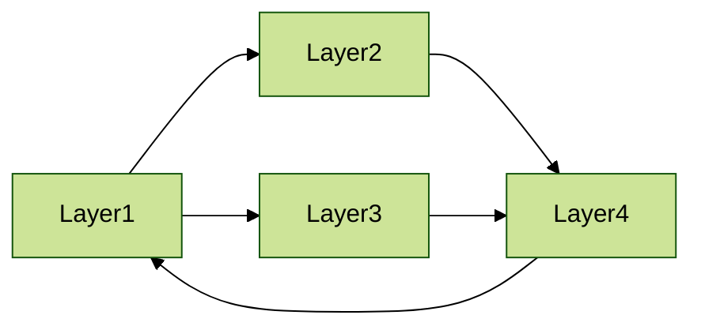

# Circular dependency

Here we test several situations where circular dependency is set. See below diagrams:

## Test `simply circular dependency with two layers`

## Test `simply circular dependency with three layers`

## Test `complex circular dependency 1`

## Test `complex circular dependency 2`

## Test `complex circular dependency 3`

