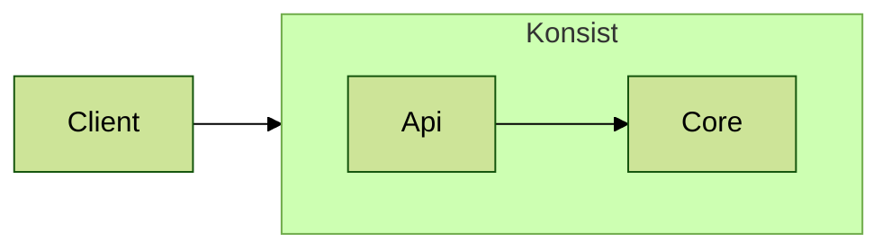

# Developer Readme

## Status

| Repository                                                                        | Build Status                                                                                                    |
|-----------------------------------------------------------------------------------|-----------------------------------------------------------------------------------------------------------------|
| [Konsist](https://github.com/LemonAppDev/konsist)                                 |                  |
| [Konsist Sample Projects](https://github.com/LemonAppDev/konsist-sample-projects) |  |
| [Konsist Documentation](https://github.com/LemonAppDev/konsist-documentation)     | -                                                                                                               |

## Release

### Sonatype

- [Nexus Repository Manager](https://s01.oss.sonatype.org/#nexus-search;quick~konsist)
- [Sonatype Jira](https://issues.sonatype.org/secure/Dashboard.jspa)

### Repositories Links

- [mvnrepository.com](https://mvnrepository.com/artifact/com.lemonappdev/konsist/)
- [central.sonatype.com](https://central.sonatype.com/artifact/com.lemonappdev/konsist/)

### Publish To Maven Repository

- `./gradlew publishToMavenLocal -Pkonsist.releaseTarget=local` publish to local `~/.m2/repository`
- `./gradlew publish -Pkonsist.releaseTarget=snapshot` publish to
  [snapshot repository](https://s01.oss.sonatype.org/content/repositories/snapshots/com/lemonappdev/konsist/)
- `./gradlew publish -Pkonsist.releaseTarget=release` publish to
  [release repository](https://s01.oss.sonatype.org/content/repositories/releases/com/lemonappdev/konsist/). This
  artefact will be transferred to [maven central](https://central.sonatype.com/artifact/com.lemonappdev/konsist)
  repository after some time.

## Generate KDocs

- `./gradlew dokkaHtml` - generate KDocs in `./lib/build/dokka/html/index.html`

## Layers

Below is a diagram of the layers of the `konsist` library:

## Test Source Sets

- `test` - unit tests with mocks (tests using `mockk` library)
- `integrationTest` - tests using real code snippets (tests using `kotest` library code)
- `konsistTest` - tests using `konsist` library using `konsist` library code

# Naming Extensions

If we create extensions with `vararg` for a property in a class we must check its return type.

## Return type

### Singular return type

create two extensions:

- with prefix 'with' and the name of the property in the singular number
    - Such extension filters all objects in which this property complies with one of the given conditions
- with prefix 'without' and the name of the property in the singular number
    - Such extension filters all objects in which this property not complies with any of the given conditions

E.g. In `KoClassDeclaration`, the `parentClass` property returns `KoParentDeclaration` (singular - it's one object), 
so we create two extensions:
    - `withParentClass(vararg names: String)`
    - `withoutParentClass(vararg names: String)`

### Return type is a list of objects

Create three extensions:
    - with prefix 'with' and the name of the property in the plural number
        - Such extension filters all objects in which this property complies with all the given conditions
    - with prefix 'withSome' and the name of the property in the plural number
        - Such extension filters all objects in which this property complies with at least one of the given conditions
    - with prefix 'without' and the name of the property in the plural number
        - Such extension filters all objects in which this property not complies with any of the given conditions

E.g. In `KoClassDeclaration`, the `parentInterfaces` property returns `List<KoParentDeclaration>` (plural - it's list 
of objects), so we create three extensions:
    - `withParentInterfaces(vararg names: String)`
    - `withSomeParentInterfaces(vararg names: String)`
    - `withoutParentInterfaces(vararg names: String)`

## If parameters of extensions is of KClass type, then extension must have suffix 'Of'.

E.g. In `KoClassDeclaration`:
    - `withParentClassOf(vararg names: KClass<*>)`
    - `withoutParentClassOf(vararg names: KClass<*>)`

    - `withParentInterfacesOf(vararg names: KClass<*>)`
    - `withSomeParentInterfacesOf(vararg names: KClass<*>)`
    - `withoutParentInterfacesOf(vararg names: KClass<*>)`
