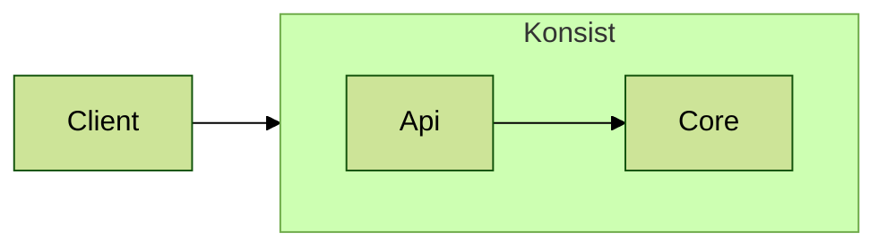

# Developer Readme

## Status
| Repository                                                                        | Build Status                                                                                                    |
|-----------------------------------------------------------------------------------|-----------------------------------------------------------------------------------------------------------------|
| [Konsist](https://github.com/LemonAppDev/konsist)                                 |                  |
| [Konsist Sample Projects](https://github.com/LemonAppDev/konsist-sample-projects) |  |
| [Konsist Documentation](https://github.com/LemonAppDev/konsist-documentation)     | -                                                                                                               |

## Release

### Sonatype

- [Nexus Repository Manager](https://s01.oss.sonatype.org/#nexus-search;quick~konsist)
- [Sonatype Jira](https://issues.sonatype.org/secure/Dashboard.jspa)

### Repositories Links
 
- [mvnrepository.com](https://mvnrepository.com/artifact/com.lemonappdev/konsist/)
- [central.sonatype.com](https://central.sonatype.com/artifact/com.lemonappdev/konsist/)

### Publish To Maven Repository

- `./gradlew publishToMavenLocal -Pkonsist.releaseTarget=local` publish to `~/.m2/repository` 
- `./gradlew publish -Pkonsist.releaseTarget=snapshot` publish to
[snapshot repository](https://s01.oss.sonatype.org/content/repositories/snapshots/com/lemonappdev/konsist/)
- `./gradlew publish -Pkonsist.releaseTarget=release` publish to
[release repository](https://s01.oss.sonatype.org/content/repositories/releases/com/lemonappdev/konsist/). This 
artefact will be transferred to [maven central](https://central.sonatype.com/artifact/com.lemonappdev/konsist) 
repository after some time.

## Layers

Below is a diagram of the layers of the `konsist` library:

## Test Source Sets

- `test` - unit tests with mocks (tests using `mockk` library)
- `integrationTest` - tests using real code snippets (tests using `kotest` library code) 
- `konsistTest` - tests using `konsist` library using `konsist` library code
